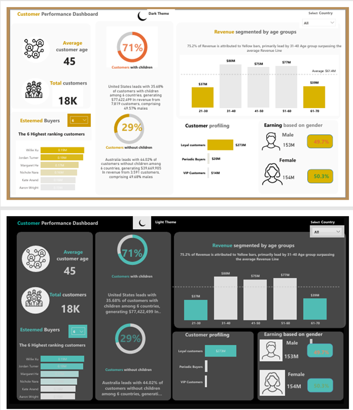

# 🛒 AdventureWorks Customer & Sales Insights in Power BI

## 📌 Project Overview

This project analyzes **AdventureWorks customer and sales data** using **Power BI** to uncover insights into demographics, revenue, customer profiling, and geographic distribution.
The goal is to enable stakeholders to make **data-driven decisions** for improving **marketing strategies, customer segmentation, and sales growth** through interactive dashboards.

---

## 🎯 Business Requirements

The analysis focuses on answering key business questions:

* **Total Customers** – How many unique customers are there?
* **Total Revenue** – What is the total sales generated?
* **Average Customer Age** – What is the mean age of customers?
* **Customers With vs Without Children** – How do family demographics impact sales?
* **Top Customers by Revenue** – Who are the highest-spending customers?
* **Revenue by Age Group** – Which age brackets contribute the most revenue?
* **Revenue by Gender** – How do male and female customers differ in sales?
* **Geographic Insights** – Which countries generate the most revenue?
* **Customer Profiling** – What is the contribution of Loyal, VIP, and Periodic buyers?
* **Dynamic Commentary** – What insights can be automatically surfaced (e.g., top region, segment contributions)?

### ✅ Expected Outcomes

* Understand **customer demographics** driving revenue.
* Identify **high-value customers** and their contribution.
* Compare **revenue distribution** across age, gender, and geography.
* Segment customers into **Loyal, VIP, Periodic** groups for marketing focus.
* Provide **dynamic, auto-updating insights** for management reporting.

---

## 📊 Dashboards

### 1️⃣ Overview Analysis

* KPIs: Total Customers, Total Revenue, Average Age
* **With vs Without Children** segmentation
* **Top 6 Customers** ranked by revenue
* **Dynamic Text Cards** highlighting leading countries
* 🌗 **Theme Toggle:** Switch between light and dark versions using the **crescent icon** at the top

---

### 2️⃣ Customer Demographics

* **Revenue by Age Group** (clustered column with average line)
* **Revenue by Gender** (pie/donut)
* **Customer Profiling** (Loyal / Periodic / VIP distribution)

---

### 3️⃣ Geographic Insights

* **Revenue by Country** (map/bar)
* Dynamic text commentary (e.g., *“United States leads with 35% of customers with children”*)

---

## ⚡ Features & Enhancements

* 🔄 **Dynamic Titles & Measures** for interactive analysis
* 🎛️ **Slicers & Filters** (Date, Geography, Customer Type)
* 💡 **DAX Measures** for KPIs and ranking logic
* 📌 **Top N Ranking** for high-value customers
* 🧾 **Documentation** (Business Requirements + Domain Document included)
* 🌗 **Light & Dark Mode Support** – Toggle between **light and dark dashboards** with the crescent icon

---

## 🛠️ Tools & Technologies

* **Power BI Desktop**
* **AdventureWorksDW\.xlsx** dataset
* **DAX (Data Analysis Expressions)** for KPIs and calculations

---

## 📂 Repository Structure

```bash
AdventureWorks-Customer-Sales-Insights/
│── data/
│   └── AdventureWorksDW.xlsx           # Source dataset
│── docs/
│   ├── Business Requirement.docx       # Business requirements document
│   └── Domain Document.docx            # Domain document (fields & definitions)
│── images/
│   └── overview.png                    # Sample dashboard screenshot
│── Customer segmentation.pbix          # Power BI report file
└── README.md                           # Project documentation (this file)
```

---

## 📸 Sample Dashboard

### Overview Analysis Light Mode(pic1) and Dark Mode(pic2)



*(You can toggle between light and dark themes inside Power BI using the crescent icon at the top.)*

---

## 👩‍💻 Author

**Divya B**

* 💼 Data & Analytics Enthusiast
* 📊 Skilled in **Power BI, SQL, Python, Machine Learning**


---

Would you like me to also add a **“How to Use the Theme Toggle” GIF or short demo screenshot** (light vs dark) under *Sample Dashboard* to make the README more visually appealing?
